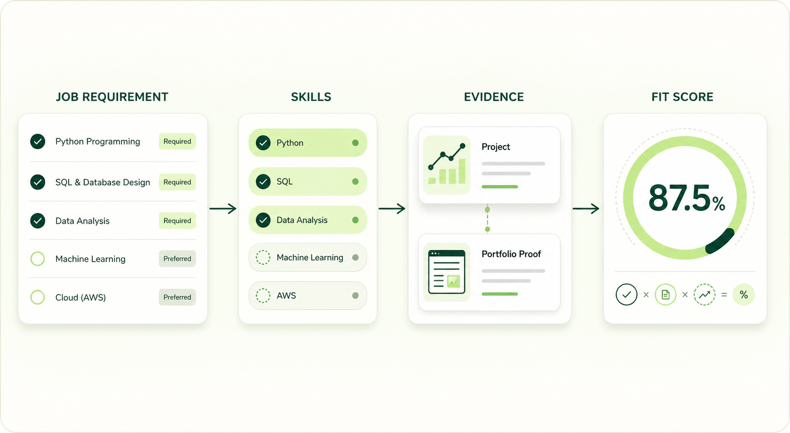

# ApplyFit

ApplyFit is an evidence-based career-readiness web application that helps job seekers understand how their current skills and proof of work align with a specific role before they apply.

Rather than producing an opaque recommendation, ApplyFit turns a job description into reviewable requirements, connects those requirements to the user's skills and evidence, and presents a transparent Fit Score. The product explains readiness while leaving the decision to apply entirely with the user.



**Current release:** `v1.0.0` — **ApplyFit Phase 1 Core MVP**

## Core workflow

1. **Job Posting** — Save a role and its job description.
2. **Requirement Extraction** — Use AI to transform the description into structured requirement drafts.
3. **Requirement Review** — Review and refine the extracted requirements before analysis.
4. **Skill & Evidence Mapping** — Connect requirements to career-profile skills and supporting evidence.
5. **Explainable Fit Score** — Understand readiness through a transparent, requirement-level analysis.

## Phase 1 Core MVP

- Secure account registration, sign-in, email verification, session management, and password recovery.
- Account settings and a dedicated career profile for career direction and skills.
- Evidence Library for projects, certifications, work experience, internships, GitHub, and portfolio proof.
- Skill-to-evidence relationships that keep readiness grounded in real work.
- Saved-job management with role, company, source, location, work arrangement, and job-description context.
- AI-assisted requirement extraction followed by user-controlled review and refinement.
- Automatic and manual requirement-to-skill mapping.
- Clear readiness states and an explainable Fit Score breakdown.
- Adaptive onboarding, recent-analysis states, responsive navigation, and protected user flows.

## Product principles

- **Evidence over claims.** Readiness should be supported by work the user can point to.
- **Explainability over magic scores.** Users should understand what contributes to their analysis.
- **AI assists; deterministic rules score.** AI helps structure job requirements, while scoring remains predictable and reviewable.
- **The user decides.** ApplyFit describes readiness without deciding whether someone should apply.
- **Every score has job context.** Readiness is evaluated for a specific saved role, not as a universal rating.

## Technology stack

| Area | Technology |
| --- | --- |
| Language | TypeScript |
| Frontend | React 19, Vinext, Vite, custom CSS, Plus Jakarta Sans, and Lucide icons |
| Backend | Server-side route handlers and domain services |
| Authentication | InsForge Auth |
| Database | InsForge PostgreSQL |
| AI extraction | OpenRouter through an OpenAI-compatible client |
| Quality | ESLint and automated Node.js tests |

## Local setup

### Requirements

- Node.js `>=22.13.0`
- npm
- Access to the required InsForge and AI services

### Install and run

```bash
git clone https://github.com/rakhaantareza/applyfit.git
cd applyfit
npm install
npm run dev
```

Configure required service credentials in an ignored local environment file. Never commit credentials or local environment values.

### Responsive screenshots

ApplyFit uses one manually registered and verified demo account for local authenticated screenshots. Add these values to the ignored `.env.local` file; never commit the password:

```bash
DEMO_EMAIL=applyfit.demo@gmail.com
DEMO_PASSWORD=your-local-demo-password
# Optional; defaults to http://127.0.0.1:3000
BASE_URL=http://127.0.0.1:3000
```

After installing dependencies, install the single supported browser once:

```bash
npx playwright install chromium
```

With `npm run dev` running at `BASE_URL`, create or refresh the reusable authenticated state through ApplyFit's real login form, then generate all approved responsive screenshots:

```bash
npm run screenshots:auth
npm run screenshots
```

`npm run screenshots` keeps the demo-account workspace captures in their authenticated context, then uses a separate context without stored authentication to capture `/login`, `/daftar`, and `/lupa-kata-sandi`.

For deterministic Dark-theme review of the authenticated Ringkasan page, run:

```bash
npm run screenshots:dark
```

The Dark command sets ApplyFit's explicit appearance preference before application scripts run and writes its responsive captures under `screenshots/dark/ringkasan/` without changing the default screenshot folders.

To capture the high-density portfolio job workflow, run:

```bash
npm run screenshots:portfolio
```

The portfolio command resolves an existing demo-account job with persisted
requirements at runtime, then writes detail, requirement-review, evidence-mapping,
and analysis images for that same job under `screenshots/portfolio/job-workspace/`.

The authenticated state is stored at `.playwright/auth/demo.json`; screenshots are written under `screenshots/<route>/<viewport-width>.png`. Both locations are gitignored because the state may contain session credentials and the images are local review artifacts. Re-run `npm run screenshots:auth` whenever the saved session expires.

### Validate

```bash
npm run lint
npm test
npm run build
```

## Future Improvements

- Career role, industry, and skill autocomplete.
- A shared skill taxonomy with canonical skill normalization.
- Improved multilingual job requirement extraction.
- A tighter Skill ↔ Evidence workflow.
- Smarter structured job input.
- A consistent design system across forms, dropdowns, selectors, and UI states.
- Job posting import from a URL.

## Release

`v1.0.0` marks **ApplyFit Phase 1 — Core MVP**, the first stable portfolio release.

## Usage notice

Copyright © 2026 Rakha Antareza. All rights reserved.

This source code is publicly available for portfolio and evaluation purposes only. No permission is granted to copy, modify, distribute, sublicense, or use this project commercially without explicit permission from the copyright holder.
