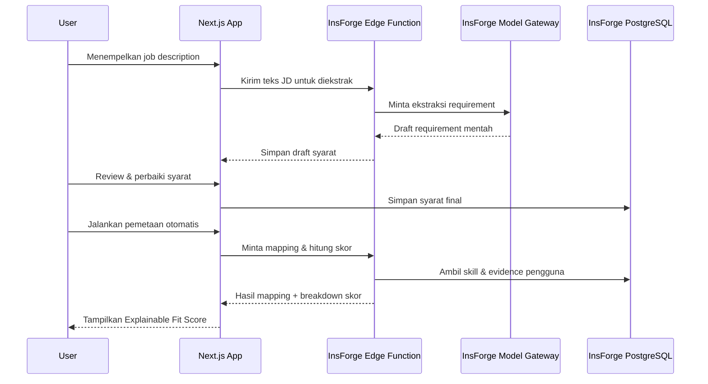
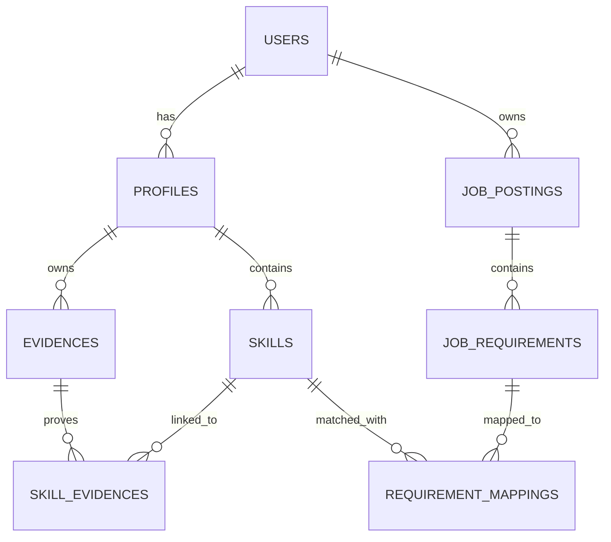

# PRD — Project Requirements Document

## 1. Overview

ApplyFit adalah aplikasi career readiness untuk fresh graduate, early-career jobseeker, dan career switcher yang ingin mengetahui seberapa cocok profil mereka dengan sebuah lowongan sebelum melamar.

Masalah utamanya adalah banyak jobseeker melakukan **blind applying**: membaca job description sekilas, lalu langsung melamar tanpa memahami requirement mana yang sudah terpenuhi, skill apa yang masih kurang, atau bukti konkret apa yang mendukung klaim kemampuan mereka. Akibatnya, lamaran sering tidak terarah, dan proses belajar dari setiap lowongan menjadi tidak efektif.

Tujuan utama ApplyFit adalah membantu pengguna menilai kecocokan secara objektif dan transparan melalui alur:

**Job Requirement → Skill → Evidence → Fit Analysis**

Dengan pendekatan ini, pengguna tidak hanya melihat angka kecocokan, tetapi juga memahami alasan di balik angka tersebut, requirement apa yang sudah terbukti, apa yang baru sebagian, apa yang masih perlu dipelajari, dan bukti apa yang mendukung setiap klaim. Semua perhitungan nilai dilakukan dengan logika bisnis yang transparan, bukan keputusan AI.

---

## 2. Requirements

- Pengguna dapat mendaftar, masuk, dan keluar dari akun dengan aman.
- Pengguna dapat membuat profil karier berisi target role, bidang pekerjaan, dan daftar skill yang dimiliki.
- Pengguna dapat menambahkan bukti keterampilan seperti proyek, pengalaman kerja/internship, sertifikat, GitHub repository, atau portofolio.
- Pengguna dapat menghubungkan bukti dengan skill yang relevan.
- Pengguna dapat menyimpan lowongan dan menempelkan job description dari platform seperti LinkedIn, JobStreet, Glints, atau lainnya.
- Sistem dapat mengekstrak requirement dari job description menggunakan AI, tetapi hasilnya wajib direview dan diperbaiki oleh pengguna sebelum digunakan.
- Setiap requirement lowongan memiliki status: **Proven**, **Partial**, **Learning**, atau **Missing**. Status ditentukan secara deterministik berdasarkan ketersediaan skill di profil dan evidence yang terhubung:
  - **Proven** — Skill tersedia di profil dan memiliki minimal satu evidence yang valid/terhubung.
  - **Partial** — Skill tersedia di profil, tetapi belum memiliki evidence yang terhubung.
  - **Learning** — Skill tidak tersedia di profil, tetapi pengguna menandai sedang dalam proses mempelajari skill tersebut (atau skill ada di daftar target profil).
  - **Missing** — Skill tidak tersedia di profil dan tidak ada tanda sedang dipelajari.
- Rule ini berlaku untuk setiap requirement yang sudah diekstrak dan diverifikasi oleh pengguna.
- Skill tanpa bukti tidak otomatis dianggap memenuhi requirement.
- Nilai kecocokan dihitung menggunakan business logic yang transparan, bukan oleh AI.
- Requirement bertipe **required** memiliki pengaruh lebih besar terhadap nilai akhir dibandingkan **preferred**.
- Sistem harus mampu menampilkan rincian nilai: requirement mana yang terpenuhi, bukti apa yang mendukung, dan bagaimana prioritas memengaruhi skor.
- Aplikasi dapat digunakan berulang kali untuk berbagai lowongan.

## 3. Core Features

### Phase 1 — Core MVP

#### Authentication

- **Login & Keamanan** — Mendaftar, masuk, dan melindungi data profil serta bukti milik pengguna.
  - **Daftar Akun** — Membuat akun baru dengan email atau metode lain yang tersedia.
  - **Masuk & Keluar** — Masuk ke akun atau keluar dari aplikasi dengan aman.
  - **Pulihkan Kata Sandi** — Mengatur ulang kata sandi apabila lupa.

#### Career Profile & Skills

- **Profil Karier** — Membuat profil berisi target peran dan daftar keahlian yang dimiliki.
  - **Target Karier** — Menentukan posisi dan bidang pekerjaan yang sedang diincar.
  - **Kelola Skill** — Menambah, mengedit, atau menghapus keahlian dari profil.
  - **Tingkat Keahlian** — Menandai level penguasaan skill, seperti mahir, menengah, atau dasar.

#### Evidence Library

- **Pustaka Bukti** — Menyimpan semua bukti keterampilan dalam satu tempat.
  - **Tambah Bukti** — Menambahkan bukti baru beserta deskripsi dan tautannya, misalnya link GitHub atau portofolio.
  - **Kelola Bukti** — Mengedit, menghapus, atau memperbarui bukti yang tersimpan.
  - **Hubungkan ke Skill** — Menautkan bukti dengan keterampilan yang dibuktikan.
  - **Cari dan Filter** — Menemukan bukti dengan cepat berdasarkan jenis atau keahlian.

#### Job Management

- **Input Lowongan** — Menyimpan lowongan dan mengolah deskripsi pekerjaan menjadi daftar syarat.
  - **Daftar Lowongan** — Melihat semua lowongan yang sudah disimpan dan memilih salah satunya.
  - **Tempel Deskripsi** — Menyalin teks job description dari platform lowongan ke aplikasi.
  - **Edit Info Lowongan** — Mengubah judul, perusahaan, atau sumber lowongan.

#### AI Job Description Parser

- **Ekstrak Syarat** — Meminta AI mengubah deskripsi menjadi daftar syarat terstruktur. AI mengekstrak requirement dari teks job description, mencakup tipe **Skill**, **Tool**, **Education**, dan **Experience**.

#### Requirement Review

- **Tinjau Syarat** — Memeriksa dan mengoreksi hasil ekstraksi AI agar sesuai dengan maksud lowongan.
  - **Perbaiki Syarat** — Menambah, mengedit, atau menghapus syarat hasil ekstraksi.
  - **Tandai Wajib atau Preferensi** — Menentukan syarat mana yang wajib dipenuhi dan mana yang hanya nilai tambah.
  - **Gabungkan atau Pisahkan** — Menggabungkan atau memecah syarat yang terlalu mirip atau terlalu umum.
  - **Simpan Hasil** — Menyimpan perubahan syarat untuk digunakan pada analisis kecocokan.

#### Requirement Mapping

- **Pemetaan Bukti** — Menghubungkan setiap syarat lowongan dengan skill dan bukti yang sesuai dari profil.
  - **Cocokkan Otomatis** — Melakukan pemetaan otomatis HANYA untuk exact skill match (contoh: SQL ke SQL). Batasan MVP: pencocokan berbasis semantik atau transferable skills (misal: 'Analisis Data' ke 'Python') TIDAK termasuk dalam core MVP dan dipindahkan ke Tier 2 (Future Work). Jika tidak ada exact match, pengguna harus menggunakan fitur 'Hubungkan Manual'.
  - **Hubungkan Manual** — Menghubungkan syarat tertentu dengan bukti yang dipilih sendiri oleh pengguna.
  - **Tandai Tanpa Bukti** — Menandai syarat yang belum punya bukti agar tidak dianggap terpenuhi.
  - **Periksa Hasil Pemetaan** — Memeriksa seluruh hubungan antara syarat dan bukti sebelum analisis dilakukan.

#### Explainable Fit Analysis

- **Skor Kecocokan** — Menampilkan nilai kecocokan antara profil pengguna dan lowongan tertentu.
  - **Ringkasan Nilai** — Menampilkan angka kecocokan keseluruhan beserta label kelayakan, misalnya “Sangat Cocok”, “Cukup Cocok”, atau “Perlu Persiapan”.
  - **Scope Perhitungan Skor (MVP)** — Skor Kecocokan HANYA menghitung requirement berbasis **Skill** (Hard/Soft Skill) dan **Tools** (Software/Hardware).
    - **Requirement Non-Skill** — Requirement seperti Pendidikan, Jumlah Tahun Pengalaman, atau Lokasi tetap akan diekstrak oleh AI dan ditampilkan sebagai informasi tambahan bagi pengguna, namun TIDAK memengaruhi perhitungan Skor Akhir pada versi MVP ini.
    - Rule ini memastikan kalkulasi skor tetap fokus pada kompetensi teknis yang bisa dipetakan ke bukti nyata.
  - **Formula Skor Kecocokan (Baseline)** — Skor akhir dihitung dengan rumus yang transparan dan deterministik:
    - `Skor Akhir = (Total Poin Saat Ini / Total Poin Maksimum) * 100`
    - Bobot prioritas requirement:
      - Required = 3 poin
      - Preferred = 1 poin
    - Bobot status keterampilan (multiplier):
      - Proven = 100%
      - Partial = 50%
      - Learning = 20%
      - Missing = 0%
    - Total Poin Saat Ini adalah penjumlahan dari `bobot prioritas × multiplier status` untuk setiap requirement.
    - Total Poin Maksimum adalah penjumlahan bobot prioritas seluruh requirement, seolah-olah semuanya berstatus Proven.
  - **Contoh Perhitungan** — Lowongan memiliki 2 requirement:
    - Req A (Required, status Proven): `3 poin × 100% = 3.0`
    - Req B (Preferred, status Partial): `1 poin × 50% = 0.5`
    - Total Poin Saat Ini = `3.0 + 0.5 = 3.5`
    - Total Poin Maksimum = `(3 × 100%) + (1 × 100%) = 3.0 + 1.0 = 4.0`
    - Skor Akhir = `(3.5 / 4.0) × 100 = 87.5%`
  - **Detail Syarat** — Menampilkan setiap requirement lowongan beserta statusnya: Proven, Partial, Learning, atau Missing.
  - **Pengaruh Prioritas** — Menjelaskan bagaimana requirement wajib dan preferensi memengaruhi nilai akhir.
  - **Bukti Pendukung** — Menampilkan bukti konkret yang digunakan untuk mendukung setiap requirement.
  - **Ganti Lowongan** — Memungkinkan pengguna berpindah ke lowongan lain untuk melihat perbandingan kecocokan.

## 4. User Flow

1. **Daftar dan masuk** — Pengguna membuat akun baru atau masuk ke akun yang sudah ada.

2. **Lengkapi Profil Karier** — Pengguna menentukan target role dan bidang pekerjaan, lalu menambahkan daftar skill beserta tingkat keahliannya.

3. **Tambahkan bukti** — Pengguna mengisi Pustaka Bukti dengan proyek, pengalaman, sertifikat, GitHub, atau portofolio, lalu menghubungkan setiap bukti dengan skill yang relevan.

4. **Simpan lowongan** — Saat menemukan lowongan menarik di LinkedIn, JobStreet, Glints, atau platform lain, pengguna menyimpan lowongan dan menempelkan job description ke aplikasi.

5. **Ekstrak dan tinjau syarat** — AI mengekstrak daftar requirement dari job description. Pengguna wajib memeriksa, memperbaiki, menandai required/preferred, serta menggabungkan atau memisahkan syarat yang kurang tepat.

6. **Lakukan pemetaan bukti** — Pengguna menjalankan pencocokan otomatis, lalu memeriksa hasilnya dan melengkapi pemetaan secara manual jika diperlukan. Syarat tanpa bukti ditandai sebagai belum terpenuhi.

7. **Lihat Skor Kecocokan** — Pengguna melihat nilai kecocokan keseluruhan, status setiap syarat, bukti pendukung, dan pengaruh prioritas terhadap nilai akhir.

8. **Bandingkan dengan lowongan lain** — Pengguna dapat beralih ke lowongan lain untuk melihat perbandingan kecocokan.

9. **Gunakan wawasan** — Setelah beberapa lowongan dianalisis, pengguna membuka Wawasan & Rekomendasi untuk melihat kesenjangan skill, saran langkah berikutnya, dan pola kecocokan dari waktu ke waktu.

---

## 5. Architecture

ApplyFit dibangun dengan arsitektur frontend dan backend yang terpisah namun terhubung melalui API.

- **Frontend** adalah aplikasi web Next.js yang berisi seluruh halaman interaksi pengguna.
- **Backend** ditangani oleh InsForge sebagai Backend-as-a-Service (BaaS). InsForge menyediakan serverless edge functions untuk menjalankan logika bisnis, PostgreSQL sebagai database utama, autentikasi, file storage, dan integrasi AI.
- **AI untuk ekstraksi requirement** berjalan melalui InsForge Model Gateway, yang menghubungkan aplikasi ke model AI melalui OpenRouter. Hasil ekstraksi AI selalu disimpan sebagai draft dan menunggu review pengguna sebelum digunakan.
- **Perhitungan skor kecocokan** tidak dilakukan oleh AI, melainkan oleh logika bisnis di edge function. Function ini membaca mapping antara requirement, skill, dan evidence, lalu menghitung status dan skor akhir secara transparan.

Berikut diagram alur utama saat pengguna menempelkan job description dan menjalankan analisis kecocokan:

Arsitektur ini memastikan pengguna selalu berada dalam kendali. AI membantu mempercepat ekstraksi syarat, tetapi keputusan akhir tetap ditentukan pengguna.

---

## 6. Database Schema

Berikut adalah tabel utama yang dibutuhkan untuk mendukung seluruh fitur ApplyFit. Tabel `users` dikelola langsung oleh InsForge Auth, sedangkan tabel lainnya dikelola oleh aplikasi.

### Penjelasan Tabel

- **users** — Dikelola oleh InsForge Auth. Field utama: `id`, `email`, `password_hash`, `created_at`. Digunakan untuk autentikasi dan kepemilikan data.

- **profiles** — Menyimpan profil karier pengguna. Field utama: `id`, `user_id`, `target_role`, `created_at`. Satu pengguna dapat memiliki satu atau lebih profil, namun pada MVP diasumsikan satu profil utama per pengguna.

- **skills** — Daftar keahlian yang dimiliki atau sedang dipelajari pengguna dalam satu profil. Field utama: `id`, `profile_id`, `name`, `status` (`active` atau `learning`), `level`, `created_at`. `name` bersifat unik per profil. Status `active` berarti pengguna menguasai skill tersebut, sedangkan `learning` berarti sedang dalam proses mempelajari.

- **evidences** — Bukti keterampilan milik pengguna. Field utama: `id`, `profile_id`, `title`, `type` (project/cert/work/internship/github/portfolio), `url`, `description`, `created_at`.

- **skill_evidences** — Relasi many-to-many antara bukti dan skill profil. Field utama: `skill_id`, `evidence_id`. Menjelaskan bukti mana yang mendukung skill mana. Entri pada tabel ini menjadi dasar penentuan status **Proven**.

- **job_postings** — Lowongan yang disimpan pengguna. Field utama: `id`, `user_id`, `title`, `company`, `raw_description`, `created_at`.

- **job_requirements** — Syarat hasil ekstraksi dan review pengguna. Field utama: `id`, `job_id`, `name`, `type` (`skill`, `tool`, `education`, `experience`), `priority` (`required`, `preferred`), `created_at`. Pada MVP, hanya requirement bertipe `skill` dan `tool` yang masuk perhitungan Fit Score.

- **requirement_mappings** — Relasi eksplisit antara syarat lowongan dan skill di profil pengguna. Field utama: `id`, `requirement_id`, `skill_id`, `user_id`. `skill_id` bersifat nullable karena pemetaan hanya terjadi jika ada skill profil yang cocok secara exact/canonical match. Tabel ini menjadi dasar traceability dan audit perhitungan skor.

### Catatan Business Logic untuk Schema

- **Status Requirement** (Proven, Partial, Learning, Missing) **tidak disimpan** di database karena bersifat dinamis (derived). Status dihitung saat runtime dengan logika deterministik:
  - Apakah ada entri di `requirement_mappings` untuk requirement tersebut? Jika tidak ada = **Missing**.
  - Jika ada, cek `skills.status` dari skill yang terpetakan:
    - Jika `status` = `learning` → **Learning**.
    - Jika `status` = `active`, cek apakah ada entri di `skill_evidences` untuk skill tersebut.
      - Jika ada → **Proven**.
      - Jika tidak ada → **Partial**.

- **Fit Score** dihitung secara on-the-fly berdasarkan join antara `job_requirements` (untuk `priority`), `requirement_mappings`, serta `skills` dan `skill_evidences` (untuk menentukan multiplier status). Hanya requirement bertipe `skill` dan `tool` yang dimasukkan ke dalam kalkulasi. Requirement bertipe `education` dan `experience` tetap ditampilkan sebagai informasi tambahan namun tidak memengaruhi skor.

- **Traceability** dijaga melalui `requirement_mappings` yang menyimpan relasi eksplisit antara setiap syarat lowongan dan skill profil pengguna. Hal ini memastikan setiap skor yang dihasilkan dapat dilacak kembali ke data sumbernya, dan mendukung skenario exact skill match (contoh: SQL → SQL) maupun pemetaan manual oleh pengguna.

## 7. Tech Stack

- **Frontend:** Next.js — digunakan untuk membangun seluruh antarmuka pengguna (user interface) aplikasi web.

- **Backend & Platform:** InsForge — satu platform backend terpadu yang mencakup semua kebutuhan server:
  - **PostgreSQL** sebagai database utama.
  - **Autentikasi** bawaan untuk email/password, OAuth, dan pengelolaan sesi.
  - **File storage** untuk menyimpan bukti seperti portofolio atau file pendukung.
  - **Edge functions** untuk menjalankan logika bisnis seperti ekstraksi requirement, pemetaan bukti, dan kalkulasi skor.
  - **Realtime** untuk pembaruan data secara langsung jika diperlukan.
  - **Transactional dan authentication email** untuk verifikasi akun dan pemulihan kata sandi.
  - **Payments** untuk kebutuhan langganan atau monetisasi di masa depan.

- **AI Provider / Gateway:** InsForge Model Gateway (OpenRouter) — digunakan untuk mengekstrak requirement dari job description. Hasil AI selalu direview pengguna sebelum disimpan.

- **Deployment:** InsForge — aplikasi di-deploy langsung melalui platform InsForge.