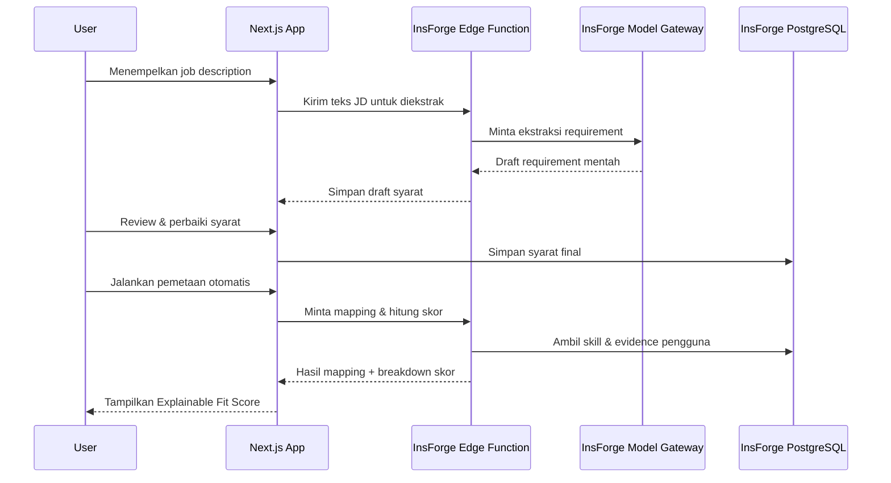
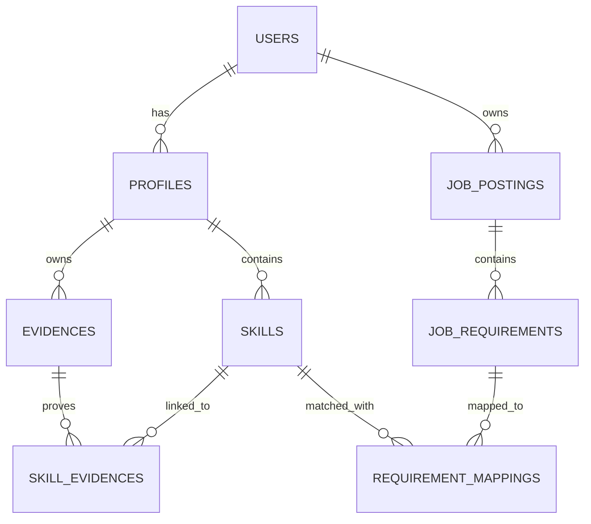

# ApplyFit — v1.0 Core MVP PRD

> **Status:** Archived / historical reference  
> **Release baseline:** v1.0.0  
> **Current product source of truth:** `product-spec.md`
>
> This document preserves the original Phase 1 Core MVP specification that led to the v1.0.0 baseline. It is historical context and must not be used to override current product behavior, UX, information architecture, terminology, or implementation decisions. When this document conflicts with `product-spec.md` or the current codebase, follow `product-spec.md` and the current implementation.

---

## 1. Overview

ApplyFit adalah aplikasi career readiness untuk fresh graduate, early-career jobseeker, dan career switcher yang ingin mengetahui seberapa cocok profil mereka dengan sebuah lowongan sebelum melamar.

Masalah utamanya adalah banyak jobseeker melakukan **blind applying**: membaca job description sekilas, lalu langsung melamar tanpa memahami requirement mana yang sudah terpenuhi, skill apa yang masih kurang, atau bukti konkret apa yang mendukung klaim kemampuan mereka. Akibatnya, lamaran sering tidak terarah, dan proses belajar dari setiap lowongan menjadi tidak efektif.

Tujuan utama ApplyFit adalah membantu pengguna menilai kecocokan secara objektif dan transparan melalui alur:

**Job Requirement → Skill → Evidence → Fit Analysis**

Dengan pendekatan ini, pengguna tidak hanya melihat angka kecocokan, tetapi juga memahami alasan di balik angka tersebut, requirement apa yang sudah terbukti, apa yang baru sebagian, apa yang masih perlu dipelajari, dan bukti apa yang mendukung setiap klaim. Semua perhitungan nilai dilakukan dengan logika bisnis yang transparan, bukan keputusan AI.

---

## 2. Requirements

- Pengguna dapat mendaftar, masuk, dan keluar dari akun dengan aman.
- Pengguna dapat membuat profil karier berisi target role, bidang pekerjaan, dan daftar skill yang dimiliki.
- Pengguna dapat menambahkan bukti keterampilan seperti proyek, pengalaman kerja/internship, sertifikat, GitHub repository, atau portofolio.
- Pengguna dapat menghubungkan bukti dengan skill yang relevan.
- Pengguna dapat menyimpan lowongan dan menempelkan job description dari platform seperti LinkedIn, JobStreet, Glints, atau lainnya.
- Sistem dapat mengekstrak requirement dari job description menggunakan AI, tetapi hasilnya wajib direview dan diperbaiki oleh pengguna sebelum digunakan.
- Setiap requirement lowongan memiliki status: **Proven**, **Partial**, **Learning**, atau **Missing**. Status ditentukan secara deterministik berdasarkan ketersediaan skill di profil dan evidence yang terhubung:
  - **Proven** — Requirement terhubung ke skill di profil (melalui mapping) yang memiliki `status = active` dan minimal satu evidence yang valid/terhubung.
  - **Partial** — Requirement terhubung ke skill di profil (melalui mapping) yang memiliki `status = active`, tetapi belum memiliki evidence yang terhubung.
  - **Learning** — Requirement terhubung ke skill di profil (melalui mapping) yang memiliki `status = learning`.
  - **Missing** — Requirement tidak memiliki entri/hubungan di tabel pemetaan (tidak ada mapping ke skill profil).
- Rule ini berlaku untuk setiap requirement yang sudah diekstrak dan diverifikasi oleh pengguna.
- Skill tanpa bukti tidak otomatis dianggap memenuhi requirement secara penuh.
- Nilai kecocokan dihitung menggunakan business logic yang transparan, bukan oleh AI.
- Requirement bertipe **required** memiliki pengaruh lebih besar terhadap nilai akhir dibandingkan **preferred**.
- Sistem harus mampu menampilkan rincian nilai: requirement mana yang terpenuhi, bukti apa yang mendukung, dan bagaimana prioritas memengaruhi skor.
- Aplikasi dapat digunakan berulang kali untuk berbagai lowongan.

---

## 3. Core Features

### Phase 1 — Core MVP

#### Authentication
- **Login & Keamanan** — Mendaftar, masuk, dan melindungi data profil serta bukti milik pengguna.
  - **Daftar Akun** — Membuat akun baru dengan email atau metode lain yang tersedia.
  - **Masuk & Keluar** — Masuk ke akun atau keluar dari aplikasi dengan aman.
  - **Pulihkan Kata Sandi** — Mengatur ulang kata sandi apabila lupa.

#### Career Profile & Skills
- **Profil Karier** — Membuat profil berisi target peran dan daftar keahlian yang dimiliki.
  - **Target Karier** — Menentukan posisi dan bidang pekerjaan (`career_field`) yang sedang diincar.
  - **Kelola Skill** — Menambah, mengedit, atau menghapus keahlian dari profil.
  - **Tingkat Keahlian** — Menandai level penguasaan skill, seperti mahir, menengah, atau dasar.

#### Evidence Library
- **Pustaka Bukti** — Menyimpan semua bukti keterampilan dalam satu tempat.
  - **Tambah Bukti** — Menambahkan bukti baru beserta deskripsi dan tautannya, misalnya link GitHub atau portofolio.
  - **Kelola Bukti** — Mengedit, menghapus, atau memperbarui bukti yang tersimpan.
  - **Hubungkan ke Skill** — Menautkan bukti dengan keterampilan yang dibuktikan.
  - **Cari dan Filter** — Menemukan bukti dengan cepat berdasarkan jenis atau keahlian.

#### Job Management
- **Input Lowongan** — Menyimpan lowongan dan mengolah deskripsi pekerjaan menjadi daftar syarat.
  - **Daftar Lowongan** — Melihat semua lowongan yang sudah disimpan dan memilih salah satunya.
  - **Tempel Deskripsi** — Menyalin teks job description dari platform lowongan ke aplikasi.
  - **Edit Info Lowongan** — Mengubah judul, perusahaan, atau sumber lowongan.

#### AI Job Description Parser
- **Ekstrak Syarat** — Meminta AI mengubah deskripsi menjadi daftar syarat terstruktur. AI mengekstrak requirement dari teks job description, mencakup tipe **Skill**, **Tool**, **Education**, dan **Experience**.

#### Requirement Review
- **Tinjau Syarat** — Memeriksa dan mengoreksi hasil ekstraksi AI agar sesuai dengan maksud lowongan.
  - **Perbaiki Syarat** — Menambah, mengedit, atau menghapus syarat hasil ekstraksi.
  - **Tandai Wajib atau Preferensi** — Menentukan syarat mana yang wajib dipenuhi dan mana yang hanya nilai tambah.
  - **Gabungkan atau Pisahkan** — Menggabungkan atau memecah syarat yang terlalu mirip atau terlalu umum.
  - **Simpan Hasil** — Menyimpan perubahan syarat untuk digunakan pada analisis kecocokan.

#### Requirement Mapping
- **Pemetaan Bukti** — Menghubungkan setiap syarat lowongan dengan skill dan bukti yang sesuai dari profil.
  - **Cocokkan Otomatis** — Melakukan pemetaan otomatis HANYA untuk exact skill match (contoh: SQL ke SQL). Batasan MVP: pencocokan berbasis semantik atau transferable skills TIDAK termasuk dalam core MVP.
  - **Hubungkan Manual** — Menghubungkan syarat tertentu dengan skill di profil secara manual.
  - **Tandai Tanpa Bukti** — Menandai syarat yang belum punya bukti agar tidak dianggap terpenuhi (Partial).
  - **Periksa Hasil Pemetaan** — Memeriksa seluruh hubungan antara syarat dan bukti sebelum analisis dilakukan.

#### Explainable Fit Analysis
- **Skor Kecocokan** — Menampilkan nilai kecocokan antara profil pengguna dan lowongan tertentu.
  - **Ringkasan Nilai** — Menampilkan angka kecocokan keseluruhan beserta label kelayakan.
  - **Scope Perhitungan Skor (MVP)** — Skor Kecocokan HANYA menghitung requirement berbasis **Skill** dan **Tools**. Requirement Non-Skill (Education, Experience, Location) TIDAK memengaruhi skor akhir.
  - **Formula Skor Kecocokan (Baseline)**:
    - `Skor Akhir = (Total Poin Saat Ini / Total Poin Maksimum) * 100`
    - Bobot prioritas: Required = 3 poin, Preferred = 1 poin.
    - Multiplier status: Proven = 100%, Partial = 50%, Learning = 20%, Missing = 0%.
  - **Contoh Perhitungan**:
    - Req A (Required, Proven): 3 x 100% = 3.0
    - Req B (Preferred, Partial): 1 x 50% = 0.5
    - Total Poin Saat Ini = 3.5. Total Poin Maksimum = 4.0. Skor = 87.5%.
  - **Detail Syarat** — Menampilkan status (Proven, Partial, Learning, Missing) dan bukti pendukungnya.

---

## 4. User Flow

1. **Daftar dan masuk** — Pengguna membuat akun baru atau masuk ke akun yang sudah ada.
2. **Lengkapi Profil Karier** — Pengguna menentukan target role dan bidang pekerjaan (`career_field`), lalu menambahkan daftar skill.
3. **Tambahkan bukti** — Pengguna mengisi Pustaka Bukti dan menghubungkannya dengan skill yang relevan.
4. **Simpan lowongan** — Pengguna menyimpan lowongan dan menempelkan job description.
5. **Ekstrak dan tinjau syarat** — AI mengekstrak requirement. Pengguna memeriksa, memperbaiki, dan menandai status wajib/preferensi.
6. **Lakukan pemetaan bukti** — Pengguna menjalankan pencocokan otomatis (exact match) atau manual mapping antara requirement dan skill profil.
7. **Lihat Skor Kecocokan** — Pengguna melihat nilai kecocokan, status syarat, dan transparansi perhitungan.
8. **Bandingkan dengan lowongan lain** — Pengguna beralih ke lowongan lain untuk melihat perbandingan.
9. **Gunakan wawasan** — (*Future Work - Bukan bagian dari Phase 1 Core MVP*) Pengguna melihat kesenjangan skill dan rekomendasi langkah berikutnya.

---

## 5. Architecture

ApplyFit menggunakan arsitektur frontend (Next.js) dan backend (InsForge BaaS).

- **Frontend:** Next.js untuk antarmuka pengguna.
- **Backend (InsForge):** Edge functions untuk logika bisnis, PostgreSQL untuk database, dan Auth untuk keamanan.
- **AI Integration:** InsForge Model Gateway (OpenRouter) untuk ekstraksi requirement. Hasil AI adalah draft yang harus divalidasi pengguna.
- **Logic:** Perhitungan skor dilakukan di Edge Function secara deterministik (bukan AI).

---

## 6. Database Schema

### Penjelasan Tabel

- **users** — Data autentikasi (`id`, `email`, `password_hash`).
- **profiles** — Profil karier pengguna. Field: `id`, `user_id`, `target_role`, `career_field`, `created_at`.
- **skills** — Daftar keahlian. Field: `id`, `profile_id`, `name`, `status` (`active` atau `learning`), `level`.
- **evidences** — Bukti fisik. Field: `id`, `profile_id`, `title`, `type`, `url`, `description`.
- **skill_evidences** — Relasi many-to-many antara bukti dan skill profil.
- **job_postings** — Lowongan yang disimpan. Field: `id`, `user_id`, `title`, `company`, `raw_description`.
- **job_requirements** — Syarat terverifikasi. Field: `id`, `job_id`, `name`, `type` (`skill`, `tool`, `education`, `experience`), `priority` (`required`, `preferred`).
- **requirement_mappings** — Relasi antara syarat lowongan dan skill profil. Field: `id`, `requirement_id`, `skill_id` (NON-NULLABLE), `user_id`.

### Catatan Business Logic untuk Schema

- **Status Requirement** (Derived Logic):
  - **Missing**: Tidak ada baris di `requirement_mappings` untuk `requirement_id` terkait.
  - **Learning**: Ada mapping ke skill yang memiliki `skills.status = 'learning'`.
  - **Proven**: Ada mapping ke skill (`active`) yang memiliki minimal satu entri di `skill_evidences`.
  - **Partial**: Ada mapping ke skill (`active`) namun tidak ada entri di `skill_evidences`.
- **Fit Score**: Dihitung on-the-fly hanya untuk tipe `skill` dan `tool`.

---

## 7. Tech Stack

- **Frontend:** Next.js.
- **Backend & Platform:** InsForge (PostgreSQL, Auth, File Storage, Edge Functions).
- **AI Gateway:** InsForge Model Gateway (OpenRouter).
- **Deployment:** InsForge Platform.